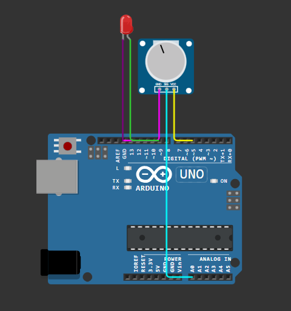
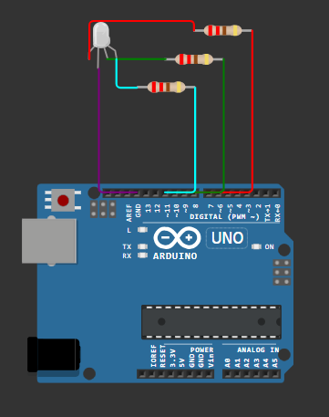
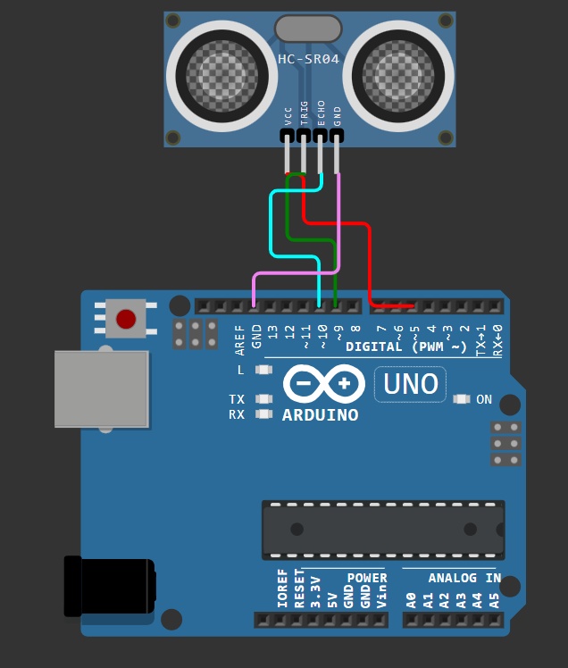

# MicrocontrollerBasics
Arduino / Wokwi projects for learning microcontroller programming, embedded systems, and basic electronics.

## Day 1 – Blink (LED Toggle)

- Simulated on Wokwi using Arduino Uno.
- Implemented a simple LED blinking program using:
  - `pinMode()`
  - `digitalWrite()`
  - `delay()`
- This is the foundational step for understanding timing and digital output control in microcontrollers.

## Day 2 – Button Toggle with Debounce
This example reads a push button using INPUT_PULLUP and toggles the built-in LED (pin 13) on each button press.  
To prevent multiple triggers caused by mechanical bouncing, a 50 ms software debounce is used.  
Only the HIGH → LOW transition (“new press event”) toggles the LED state.
Concepts learned:

-`Digital input (reading a push button)`

-`Internal pull-up resistor (INPUT_PULLUP)`

-`Edge detection (HIGH → LOW)`

-`Boolean state toggling (state = !state)`

-`Simple software debounce`

-`Controlling digital output (LED)`

### 📝 How it works
- The button is connected to **pin 2** and uses an internal pull-up resistor.  
  - Not pressed → pin reads **HIGH**  
  - Pressed → pin is pulled to **LOW**  
- The code compares the current reading with the previous state.  
- A toggle happens **only** when the button transitions from HIGH → LOW.  
- A small 50 ms debounce delay prevents false triggers.
  
The file is located in:  
`day2_button_toggle/button_toggle.ino`

### 🖥️ Simulation
The project can be tested using Wokwi (Arduino Simulator).  
A push button press toggles the LED and prints `ON` or `OFF` in the Serial Monitor.

## Day 3 – PWM LED Fade
This project demonstrates how to control LED brightness using PWM (`analogWrite`).  
By gradually increasing and decreasing the duty cycle between 0 and 255, the LED creates a smooth fade-in and fade-out effect.

### 🔧 Concepts learned
- PWM (Pulse Width Modulation)
- Duty cycle control (0–255)
- analogWrite() usage
- Loop animation logic
- Automatically reversing direction at brightness limits
  

## Day 4 – Potentiometer to PWM (Analog Input → LED Brightness Control)
This project demonstrates how an analog input signal (from a potentiometer) can be processed and mapped to control the brightness of an LED using PWM (Pulse Width Modulation).  
It is a fundamental example of a **sensor → processing → actuator** pipeline used in robotics, drones, and laser automation systems.

### 🔧 1. Circuit Overview
A potentiometer is used as a variable voltage divider.  
- One outer pin is connected to **5V (VCC)**  
- The other outer pin is connected to **GND**  
- The middle pin provides a continuously adjustable voltage between 0–5V

This middle pin is connected to **A0**, allowing Arduino to measure the input voltage as a value between `0–1023`.

The LED is controlled through a PWM-enabled digital pin (**D9**), with the current limited by a 220Ω resistor.

## Day 5 – RGB LED PWM Color Fading

This project demonstrates how to control an RGB LED using three independent PWM channels.  
By smoothly adjusting the PWM duty cycle of the red, green, and blue channels, the LED transitions between colors automatically.

This is a fundamental technique used in:
- Robotics  
- UAV / drone lighting and signaling  
- Laser system indicators  
- General embedded systems  
- Any multi-channel actuator control scenario  

---

### 🔌 1. Circuit Overview

We use a **common cathode RGB LED**, which means all LED diodes (R, G, B) share the same ground pin.

Each LED channel must have its own **current-limiting resistor**:

| LED Color | Arduino Pin | Notes |
|----------|-------------|-------|
| Red      | D9          | PWM output + 220Ω resistor |
| Green    | D10         | PWM output + 220Ω resistor |
| Blue     | D11         | PWM output + 220Ω resistor |
| Common   | GND         | Shared ground | 

# Day 6 – Ultrasonic Distance Measurement (HC-SR04)

This project measures distance using the **HC-SR04 ultrasonic sensor** and prints the result to the serial monitor (cm).

It demonstrates core embedded concepts:
- Digital I/O (`pinMode`, `digitalWrite`)
- Pulse timing measurement (`pulseIn`)
- Converting time-of-flight to distance using the speed of sound

---

## Hardware / Wiring

HC-SR04 pins:

| HC-SR04 | Arduino UNO |
|--------|-------------|
| VCC    | 5V          |
| GND    | GND         |
| TRIG   | D9          |
| ECHO   | D10         |

---

## How it works

1. The Arduino sends a **10 µs trigger pulse** on `TRIG`.
2. The sensor emits an ultrasonic burst and sets `ECHO` **HIGH** while it waits for the echo.
3. When the echo returns, `ECHO` goes **LOW**.
4. `pulseIn(echoPin, HIGH)` measures the duration of the HIGH pulse (µs), which equals the **round-trip** travel time.

### Commit 2 – Moving Average Filter
- Added a moving average filter (window size N=5)
- Prints both raw and filtered distance for comparison
- Improves stability and reduces measurement noise

### Commit 3: Ultrasonic Distance Measurement with RGB Feedback
In this project, an ultrasonic distance sensor is used to measure object distance in real time.  
To improve measurement stability, a **moving average filter** is applied.  
The filtered distance is visualized using an **RGB LED status indicator**.

### Features
- Time-of-flight distance measurement using `pulseIn()`
- Timeout handling to avoid blocking execution
- Moving average filtering for stable output
- RGB LED feedback based on filtered distance
- Serial monitor output for debugging and analysis

### Status indication
- **Green**: Safe distance (> 100 cm)
- **Yellow**: Caution (50–100 cm)
- **Orange**: Alert (20–50 cm)
- **Red (blinking)**: Danger (< 20 cm)
- **Blue**: No echo / out of range
.png)

